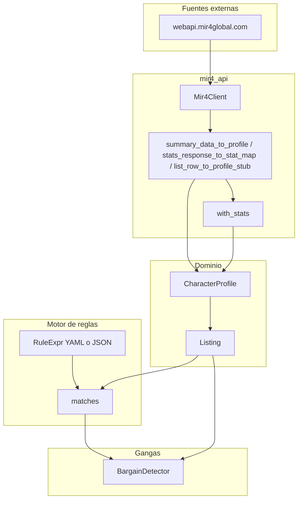

# Arquitectura de xdraco-marketer

Visión de conjunto del repositorio: capas, flujos de datos y extensiones habituales.

## Diagrama lógico

## Capas

| Capa | Rol | Ubicación principal |
|------|-----|---------------------|
| **Modelos** | `CharacterProfile` (clase, power, skills, ítems, pets, piedras, stats) y `Listing` (precio, moneda, metadatos). | `src/xdraco_marketer/models/` |
| **Reglas** | AST discriminated (`and` / `or` / `not` + condiciones atómicas), carga YAML/JSON, evaluación `matches(profile, rule)`. | `src/xdraco_marketer/rules/` |
| **Gangas** | Filtra listados que cumplen la regla y marca precio bajo vs mediana del cohorte. | `src/xdraco_marketer/bargains/` |
| **API MIR4** | Cliente HTTP, normalización de summary/stats/list a perfiles, armado de `Listing`. | `src/xdraco_marketer/mir4_api/` |
| **CLI** | Comandos `list`, `scan`, `bargains`. | `src/xdraco_marketer/cli.py` |

## Flujo típico “mercado → decisión”

1. **Listado:** `GET /nft/lists` devuelve filas con `seq`, `transportID`, `price`, `class`, `powerScore`, stats parciales.
2. **Detalle (opcional por NFT):** `GET .../summary?seq=` (equipo, piedras, pets) y `GET .../stats?transportID=` (lista completa de stats con `statName` / `statValue`).
3. **Normalización:** se construye un `CharacterProfile` unificado; los stats usan claves derivadas del **statName** de la API (texto normalizado, sin depender de iconos PNG).
4. **Reglas:** una `RuleExpr` filtra perfiles deseados (build de cohorte).
5. **Gangas:** `BargainDetector` compara precios dentro del cohorte que cumple la misma regla.

## Puntos de extensión

- **Nueva condición:** añadir modelo en `rules/ast.py`, rama en `rules/evaluate.py`, tests en `tests/test_rules_engine.py`, documentar en el template de agente.
- **Nueva fuente de datos:** adaptador que rellene `CharacterProfile` / `Listing` sin cambiar el motor de reglas si el modelo ya cubre el dato.
- **Otra métrica de “barato”:** extender `BargainSettings` / `BargainDetector` (mantener tests).

## Dependencias entre módulos

- `rules.evaluate` solo depende de `models` y `rules.ast` (no de HTTP).
- `bargains` depende de `models` y `rules`.
- `mir4_api` depende de `models`; no importa `bargains`.

Esto permite testear reglas y gangas sin red ni cliente HTTP.
